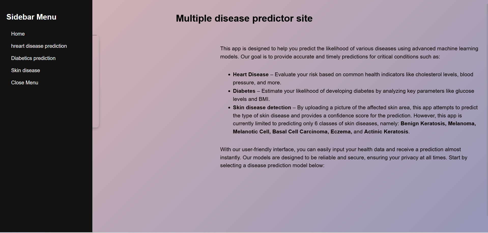
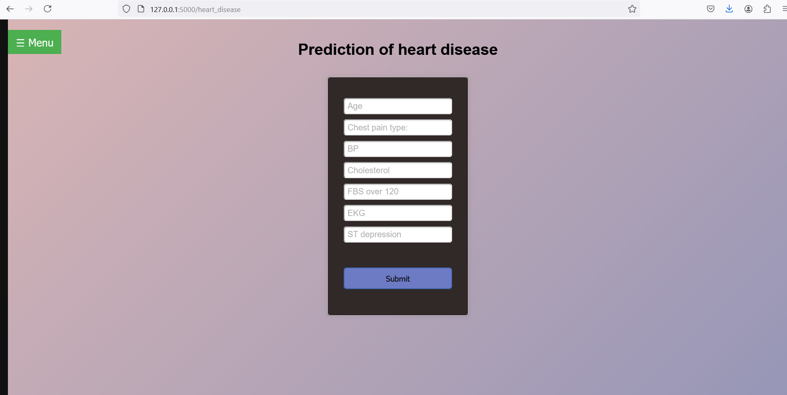

# Multi Disease Predictor App using Flask
This is a simple web application which is designed to predict multiple diseases based on input data. The predictions are generated using a deep learning model deployed via a Flask web application.
# Features
* Predicts multiple diseases such as heart disease, dibetics and skin disease
* The application is capable of predicting six different types of skin diseases, which include,Benign Keratosis, Melanoma, Melanotic Cell, Basal Cell Carcinoma, Eczema and Atopic Dermatitis
* User-friendly web interface.
* For skin disease , Displays prediction results with confidence scores for each skin diseases.
# Model Details for Each of the Disease
### Heart Disease Prediction
For heart disease prediction, Support Vector Machine (SVM) model is employed. The model achieved a testing accuracy of 68%. The dataset used for training was sourced from Kaggle and contains only 270 rows, which limits the model's ability to generalize effectively. 
The accuracy can be improved by expanding the dataset, as a larger dataset would provide more diverse patterns for training, leading to better model performance.
### Dibetics Prediction
The dataset used for dibetics prediction is *pima indian dibetics dataset* which has 768 rows with 9 feature columns. A several ML model is applied on this dataset and measured the test accuracy. 
It is found that logistics regression model works better with accuracy of 79%.
### Skin Disease Prediction

For skin disease prediction, the model utilizes XceptionNet enhanced with a Convolutional Block Attention Module (CBAM), achieving a test accuracy of 89%.
# Screenshots of the Application

- **Home Page**  
  

- **Heart Disease Prediction**  
  

- **Diabetes Prediction**  
  

- **Skin Disease Prediction**  
  
